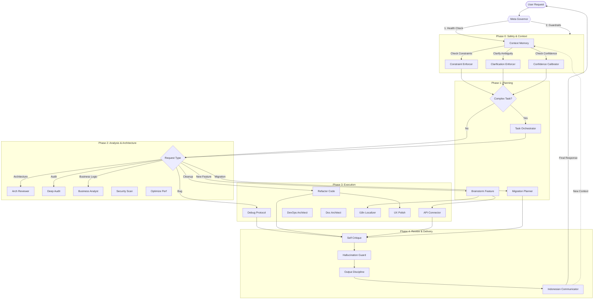

# Antigravity Skills 🧠

A collection of **30 specialized AI agent skills** that turn a general-purpose LLM into a disciplined, expert engineering team.
This repository acts as the "neocortex" for your Antigravity agent.

## 🚀 Installation (One-Command)

Run this command in your terminal to install these skills directly into your Antigravity agent.

### 🍎 macOS / 🐧 Linux (Bash/Zsh)
```bash
# Backup existing skills (optional)
mv ~/.gemini/antigravity/skills ~/.gemini/antigravity/skills_backup_$(date +%s) 2>/dev/null

# Install
git clone git@github.com:hadimiftahulf/antigravity-skills.git ~/.gemini/antigravity/skills
```

### 🪟 Windows (PowerShell)
```powershell
# Backup existing
if (Test-Path "$env:USERPROFILE\.gemini\antigravity\skills") { Rename-Item "$env:USERPROFILE\.gemini\antigravity\skills" "skills_backup_$(Get-Date -Format FileDateTime)" }

# Install
git clone git@github.com:hadimiftahulf/antigravity-skills.git "$env:USERPROFILE\.gemini\antigravity\skills"
```

---

## ⚙️ How it Works

1.  **The Trigger**: Every user request is intercepted by the **`meta-governor`**.
2.  **The Decision**: The governor consults the **`skill-activation-policy`** to decide *who* should handle the task.
3.  **The Download**: The agent "reads" the specific `SKILL.md` file (e.g., `debug-protocol`), effectively "downloading" the expertise for that specific moment.
4.  **The Execution**: The agent follows the strict step-by-step workflow defined in the skill, ensuring high-quality, consistent output.


---

## 🧠 Skill Flow & Interconnection

The following diagram visualizes how the 30 skills interact. The `meta-governor` is the central hub, ensuring no skill is isolated.



---


## 📚 Skill Catalog

### 🏛️ Governance (The Brain)
*Managing the Agent's lifecycle and decisions.*
- **`meta-governor`**: The absolute authority. Decides which skills to activate and enforces execution order.
- **`skill-activation-policy`**: The Rulebook. Defines the "laws" of when a skill is allowed to run.
- **`task-orchestrator`**: The Planner. Breaks down complex, multi-step requests into atomic tasks.
- **`context-memory`**: The Scribe. Compresses long conversations and remembers high-level decisions to prevent "amnesia".

### 🛡️ Guardrails (The Safety Net)
*Preventing mistakes before they happen.*
- **`constraint-enforcer`**: Prevents "Stack Drift". Forbids installing new libraries or changing styles without permission.
- **`hallucination-guard`**: The Fact-Checker. Verifies packages and methods actually exist before writing code.
- **`confidence-calibrator`**: The Adult. Decides when to act automatically (High Confidence) vs. when to ask (Low Confidence).
- **`clarification-enforcer`**: The Skeptic. Stops the agent from guessing when requirements are ambiguous.

### 🏗️ Architecture (The Blueprint)
*Ensuring long-term code health.*
- **`deep-audit`**: Layer Police. Enforces strict separation between UI, State, and Logic (e.g., "No DB calls in Views").
- **`arch-reviewer`**: Design Pattern Specialist. Checks for SOLID principles and suggests patterns (Factory, Strategy, etc.).
- **`advanced-architecture`**: Enterprise Architect. Handles DDD, Event Sourcing, and CQRS implementations.
- **`security-scan`**: The Hacker. Scans for OWASP vulnerabilities and leaked secrets (API keys, env vars).
- **`optimize-perf`**: The Profiler. Systematically hunts down N+1 queries, memory leaks, and slow renders.
- **`devops-architect`**: The SysAdmin. Automates Docker, CI/CD pipelines, and Nginx configs.

### 🛠️ Execution (The Hands)
*Doing the actual coding work.*
- **`debug-protocol`**: The Scientist. A strict 3-phase workflow (Reproduce -> Isolate -> Fix) to solve bugs without guessing.
- **`refactor-code`**: The Janitor. Safely improves code structure without changing behavior, enforced by tests.
- **`migration-planner`**: The DB Admin. Plans safe database schema changes with rollback strategies.
- **`api-connector`**: The Integrator. Builds robust API clients with retries, rate limiting, and DTOs.
- **`self-critique`**: The Editor. A loop where the agent reviews its own code *before* showing it to you.
- **`error-taxonomy`**: The Classifier. Standardizes error handling (User vs System errors) and logging.

### 🎨 Product & Design (The Vision)
*Translating requirements into specs.*
- **`business-analyst`**: The Detective. Maps code to business logic and domain rules.
- **`brainstorm-feature`**: The Inventor. deeply researches and specs out new features before writing a single line of code.
- **`tool-strategy`**: The Procurement Officer. Selects the right libraries based on maintenance, size, and license.
- **`ux-polish`**: The Designer. Enforces premium aesthetics, consistency, and accessibility (A11y).
- **`doc-architect`**: The Librarian. Automatically writes and maintains READMEs, ADRs, and API docs.

### 🗣️ Communication (The Voice)
*Interfacing with the human.*
- **`indonesian-communicator`**: Enforces all user-facing explanations to be in professional Bahasa Indonesia.
- **`output-discipline`**: Enforces concise, markdown-formatted responses. No fluff.
- **`stakeholder-translator`**: Translates technical jargon into business value for non-technical stakeholders.
- **`i18n-localizer`**: The Translator. Ensures all text is extracted to translation files for multi-language support.
